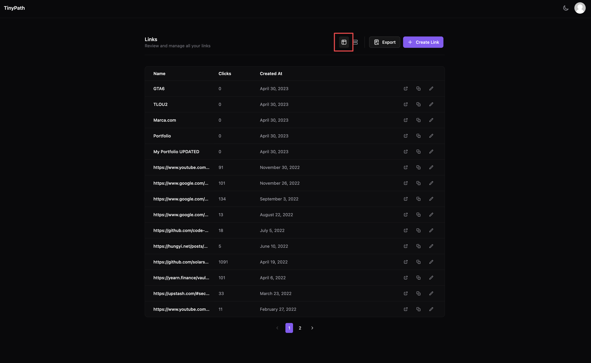
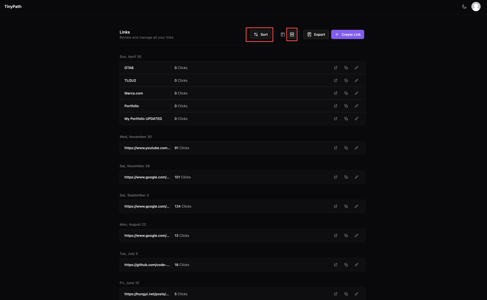
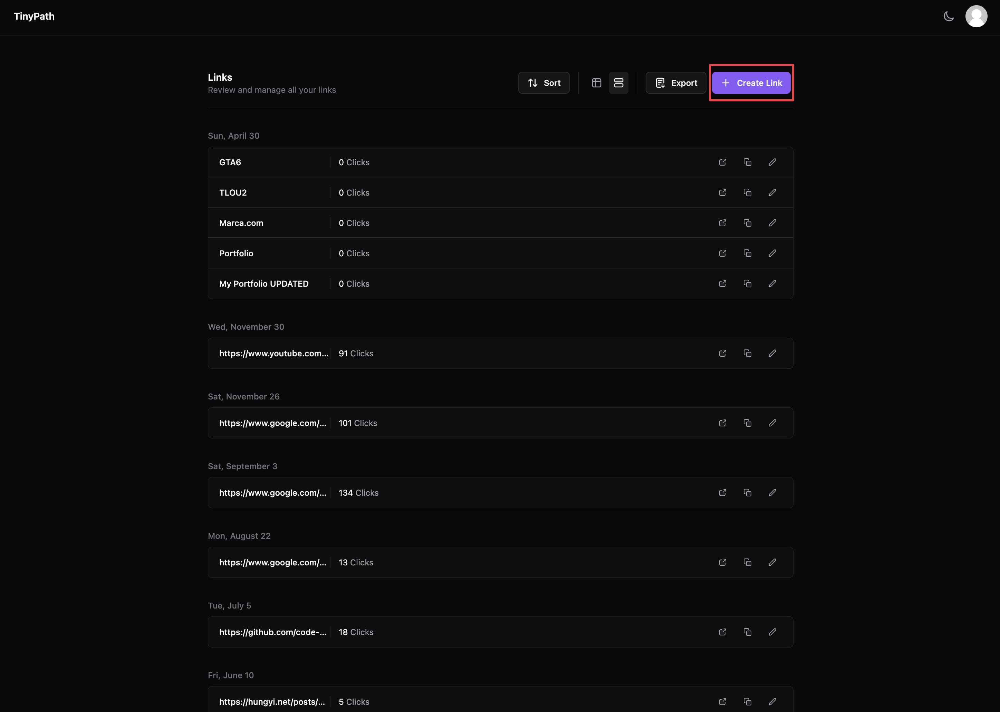
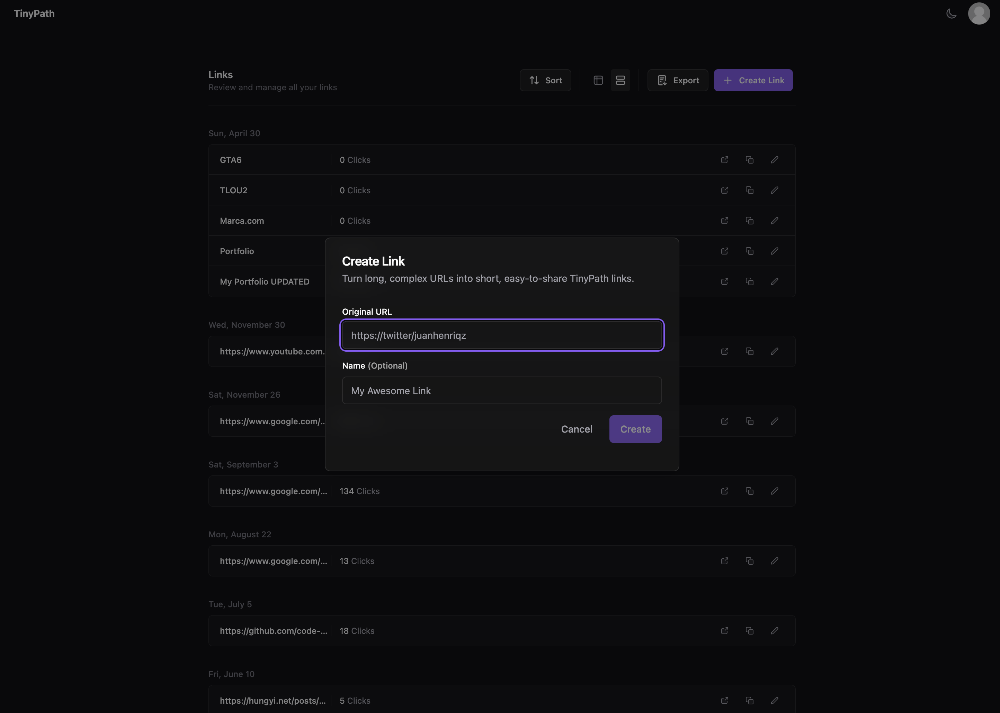
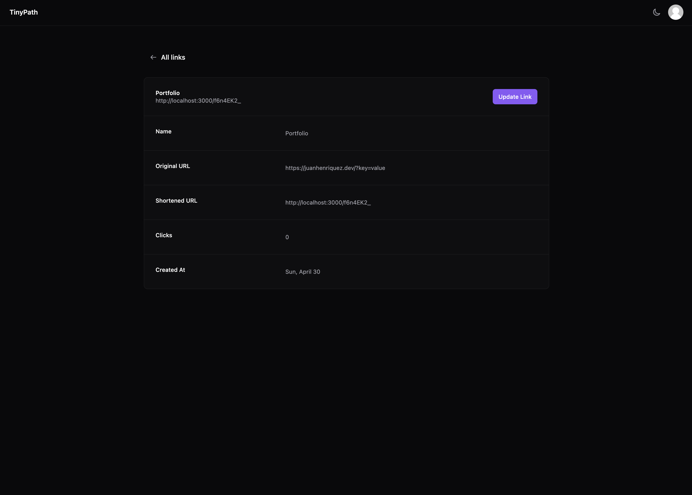
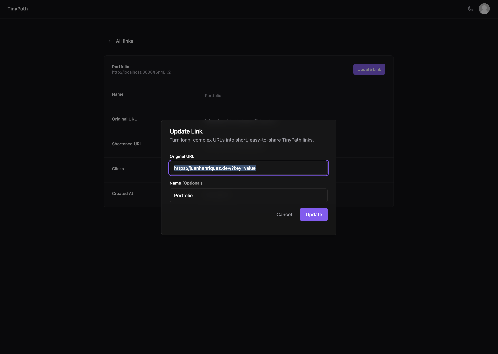

# TinyPath

TinyPath is a URL shortener app that allows users to create shortened, easy-to-remember links for their long and complex URLs.

To see the app live, you can visit it at https://tinypath.vercel.app

### Tech Stack

- Turborepo: To share packages between apps.
- Next.js 13: App folder with support for React Server Components.
- Postgres & Prisma: As the database solution.
- Radix UI & TailwindCSS: Build the UI with beautiful and highly accessible components.
- Supbase as the databse provider.
- E2E tests with Playwright.
- Vercel as the hosting of the web app.
- Clerk for Authentication/Authorization.

### Features

- Monorepo Setup.
- Authentication (Each user has their own links).
- Dashboard Page:
  - Allows user to create a shortened link
  - Allows user to see all the links they have created.
  - Allows user to download a CSV of all the links through the "Export" button.
  - Allows user to switch between 2 layouts: Table and Group.
  - Allows user to sort in ascending/descending order for the created date and clicks count.
  - Allows user to navigate, copy and go to the edit page of each link.
- Edit Link page:
  - Allows user to se all the info related to given link.
  - Allows user to update the link.
  - Allows user to delete the link.
- Responsive and modern UI.
- Dark/Light mode.
- Fully accessible and navigable with keyboard.

### Set up

1. In the root of the project there is a `.env.example` file. You need to copy this file and create a new `.env` file (Without the .example at the end).
2. Then, go to the `/apps/web/env.local.example` and copy the file and create a new one called just `.env.local`.
3. In order to run this project locally, you will need to use the `docker-compose.yml` file to deploy the local Postgres server.

```bash
docker-compose up
```

4. Once the database is ready, you need to run the Primsa migrations to create the tables we need in the db:
```bash
npm run db:push
```

5. You are ready to start the development server by running:

```bash
npm run dev
```

---

### Testing
TinyPath uses Playwright for their E2E testing.

Before running the tests, you need to have the database instance running (See the Setup Section) with a `test` database.

Once you have the db running, You can run the e2e test by running:

```bash
npm run test:e2e
```
---

### App Structure

Let’s begin with a brief overview of the most important parts of this app:

#### Frontend: 
There are only 5 pages in this app:
 - `/auth/sign-in`: Sign in page.
 - `/auth/sign-up`: Sign up page.
 - `/dashboard`: Table/Group view of all the links created by the user.
 - `/links/[linkId]`: Edit/Info page for Links.
 - `/[linkShortenedId]`: Link redirect URL.

##### Notes:
- This app was made with Next.js 13 which is the version that introduced React Server Components (RSC) to their ecosystem.
- All the pages of this app are RSC with some Client components as children components.
- All of the pages specific components are located under the `/app` folder, close to the pages that render them.
- All the primitive components or all the components shared by pages are located inside the `/components` folder.
- Core/Primitives components like Dialogs, Popovers, DropdownMenus, etc were created with RadixUI and TailwindCSS. Some of them are inspired in Shadcn UI library: https://ui.shadcn.com/
- This app makes use of `react-query` for client-side data fecthing and data mutation.
- The `/dashboard/page.tsx` is an example of how `react-query` can be used for both paginated sets of data like in the "Table" view OR for an infinite-view UI like the "Group" view.
- The `/links/[linkId]/page.tsx` is an example of how powerful RSCs are, as they allow us to query the DB directly from within the component.

#### Backend: 
There are only 5 endpoints:
 - `GET /api/links`: Get all the links for the user in session with pagination support.
 - `POST /api/links`: Create a link.
 - `GET /api/download`: Download a CSV of all the links created by the user.
 - `PUT /api/links/[linkId]`: Edit the details of a link.
 - `DELETE /api/links/[linkId]`: Delete a link.

##### Notes:
- This app uses Clerk as the Authentication provider as it is really a good choice for small to medium projects because of its simplicity, flexibility and developer experience. Plus, their security features are really good.
- The majority of endpoints of this app are user authenticated.
- Prisma was the choosen ORM to talk to the Postgress DB because of all the Developer experience (DX) features it offers like type safety queries.
- All of the endpoints created for this app were created using Next.js 13 Route hanlders.
- The Prisma schema and all the Prisma related code is within the `database` package.

---
## Screenshots

### The Dashboard:

The `/dashboard` page is where can see the list of links generated by the user.

#### Layout Modes:

There are 2 layout modes available: Table and Group.

- **Table layout**: In the Table layout you can see all the links created by the user in paginated table. The user is allowed to sort by created date or clicks count.



- **Group layout**: In the Group layout, links are grouped by date in a nice looking UI with Infinite Loading.
  In this layout mode there is a new "Sort" button available at the top where you can sort by Date AND Clicks count at the same time.



Boths layouts make use of the `GET /api/links` endpoint which returns a paginated set of results
based on some query params like `take`, `page`, etc.

For demostration purposes, the **Table layout** uses a regular react-query's `useQuery` to fetch the paginated set of data,
while the **Group layout** uses `useInfiniteQuery` to demostrate the capabilities of the 2 methods of showing paginated sets of data.

#### Link Creation:



From the dashboard, users have a “Create Link” button at the top of the page. This button displays a custom dialog component with a form to create the link.

Users can give the link an optional, easy-to-remember name.



Once the user submits the form, we immediately update the UI by invalidating the queries responsible for retrieving the list of links.

### Link Details page:



Users can go to `/links/[linkId]` page and see the details of each link they created.

Users can update the original URL of their link. This sends a `PUT` request to `/api/links/[linkId]` behind the scenes to make the change.

They can also delete the link by clicking the "Delete" button.



Is worth mentioning that the click count only resets if the users modifies the original link. If the user only updates the name of the link, the click count will remain the same.

